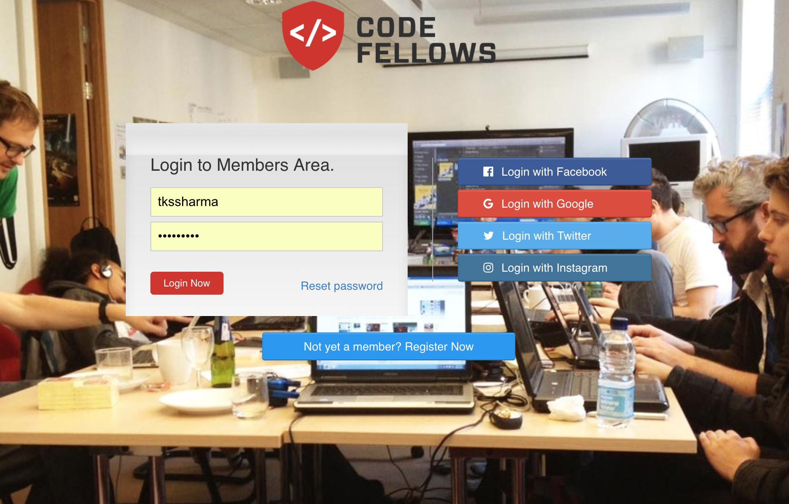
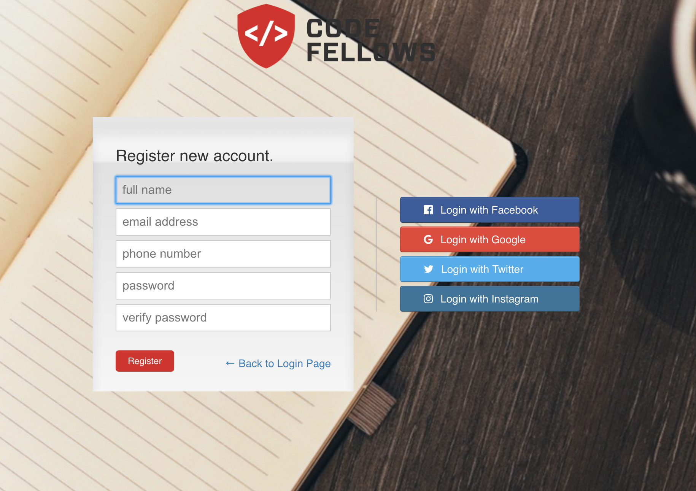
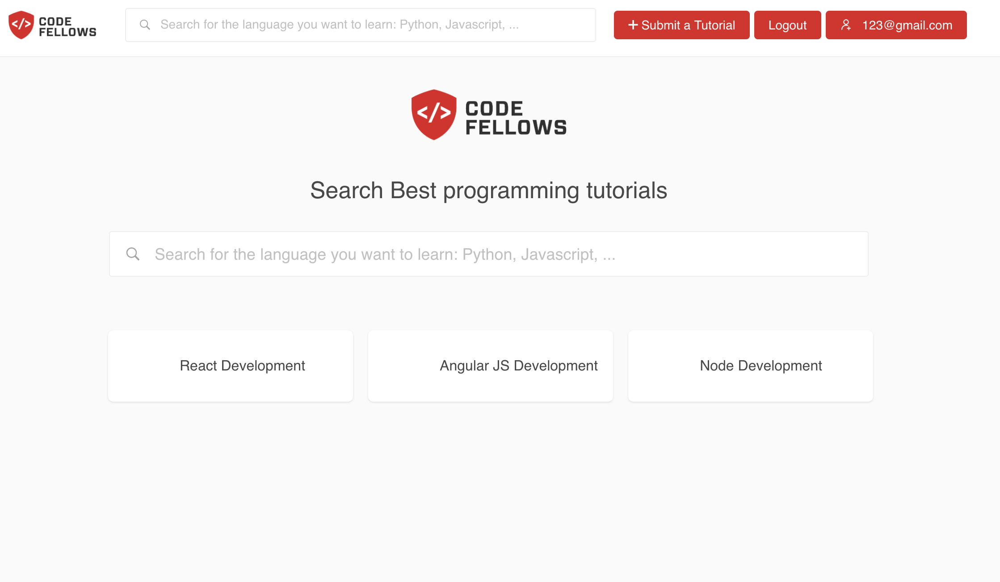

# My Application Front-End {React-redux}
### next.io platform for getting learning videos

### Application screens

## Get Started
Install dependencies in your project directory with:
`npm install`
In the project directory, you can then run:
 `npm run start-local`
Runs the app in the development mode. 
Open [http://localhost:8080](http://localhost:8080) to view it in the browser.
 `npm run build`
Builds the app for production to the `build` folder. 
It correctly bundles React in production mode and optimizes the build for the best performance.
The build is minified and the filenames include the hashes. 
Your app is ready to be deployed!
REST API to support application features

  - Redux used with reducers
  - React used with ES6 + Webpack
  - Redux is used with Immutable JS
  - React Routing using React-Router
  - Redux forms for validation and data submit

# MEAN application using passport login and Node JS API #

"Its my personal portal application which i am using for providing training to other people , it has everything in it clinet side code and server side code which is deployed on heroku and using mongolab for mongo DB.

The application allows you to browse through a list of available courses and also provide you the platform to learn new things.

REST API developed in Node and React is consuming those services with Redux as state manager.
